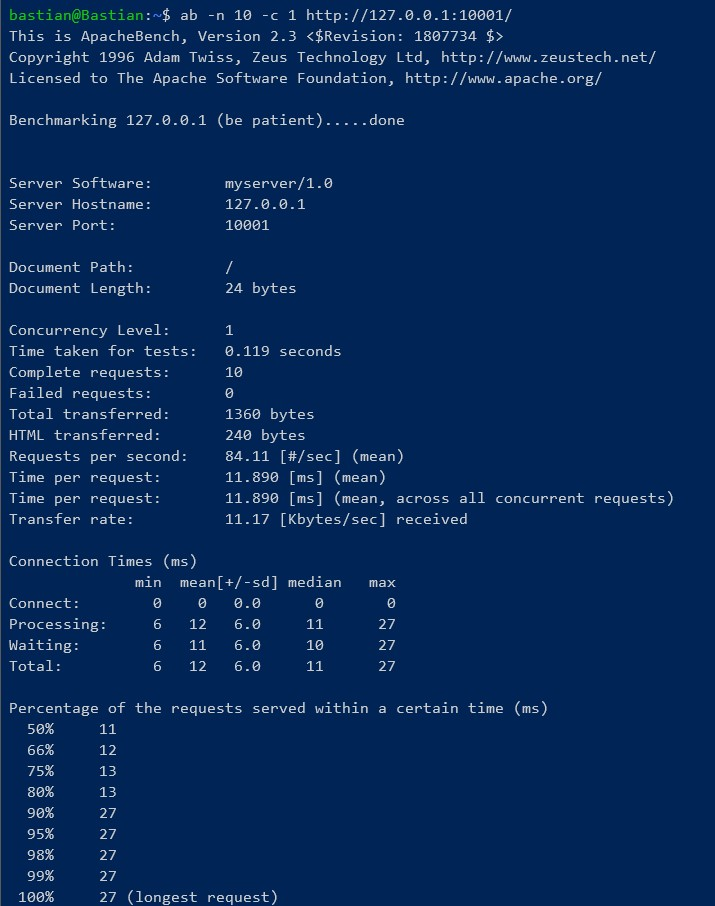
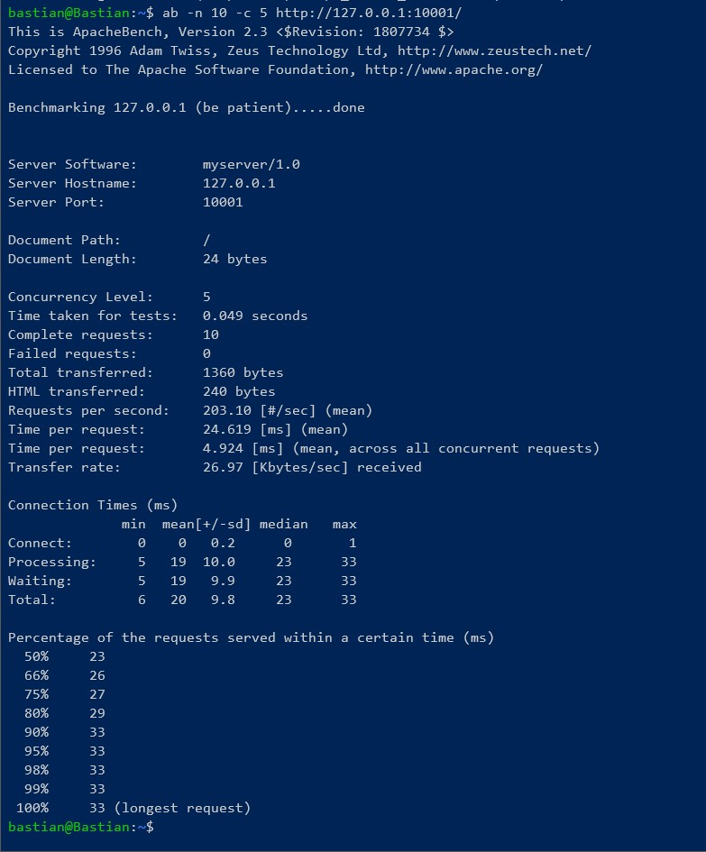
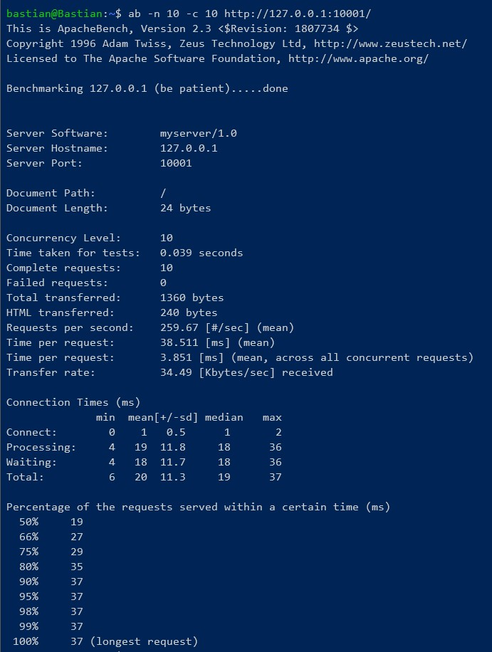
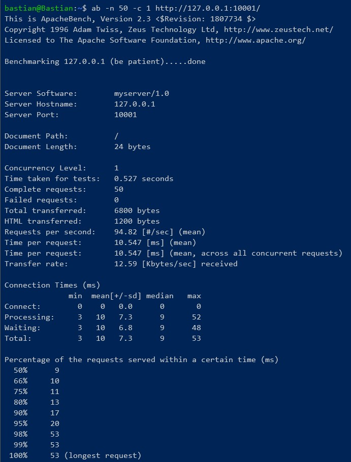
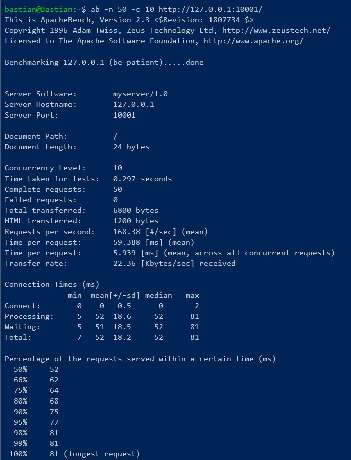
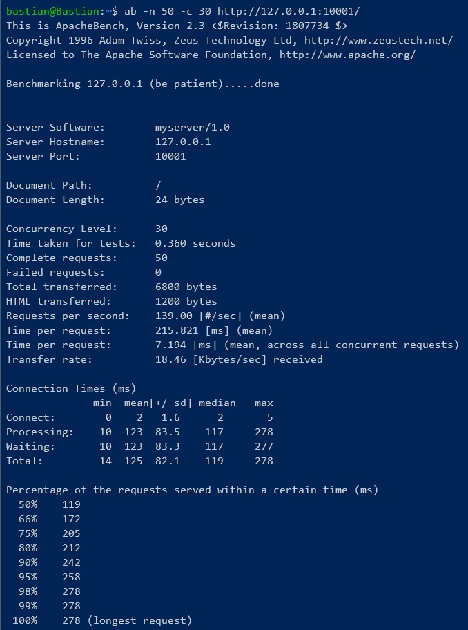
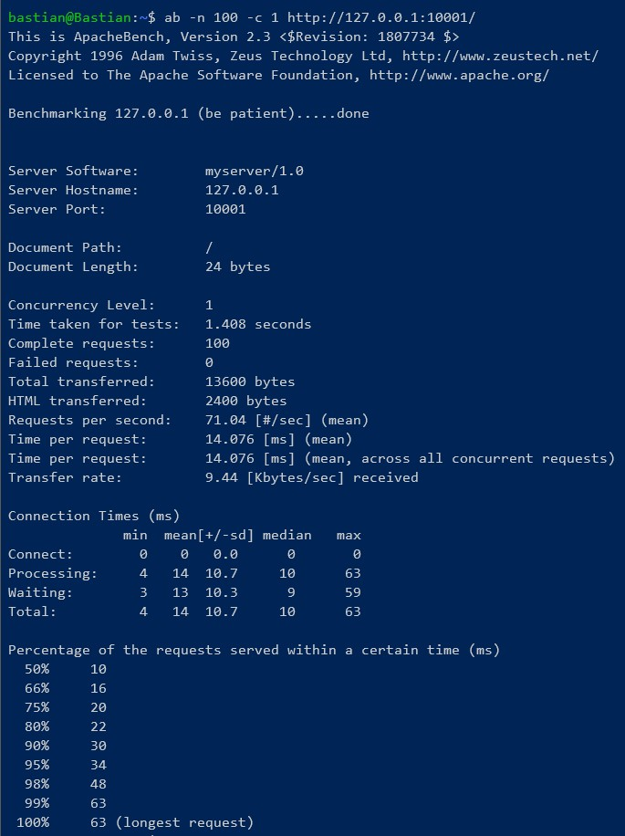
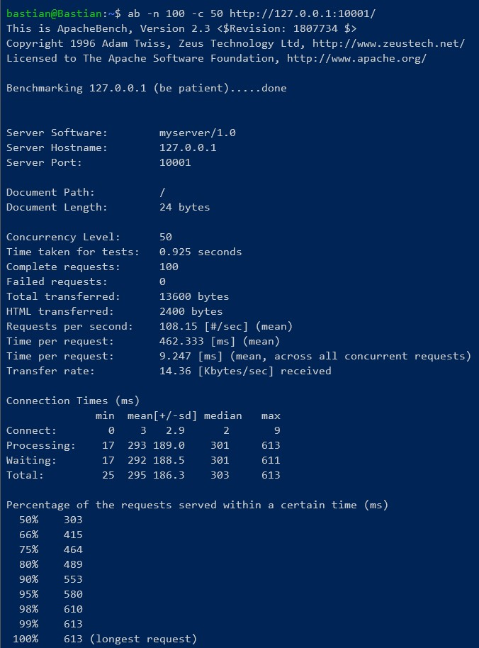
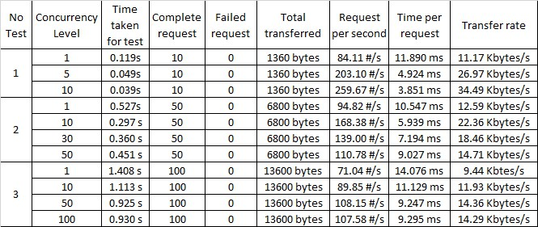

# Tugas 7

## Hasil benchmark dengan jumlah request 10 dan konkurensi 1

## Hasil benchmark dengan jumlah request 10 dan konkurensi 5

## Hasil benchmark dengan jumlah request 10 dan konkurensi 10

## Hasil benchmark dengan jumlah request 50 dan konkurensi 1

## Hasil benchmark dengan jumlah request 50 dan konkurensi 10

## Hasil benchmark dengan jumlah request 50 dan konkurensi 30

## Hasil benchmark dengan jumlah request 50 dan konkurensi 50

## Hasil benchmark dengan jumlah request 100 dan konkurensi 1

## Hasil benchmark dengan jumlah request 100 dan konkurensi 10

## Hasil benchmark dengan jumlah request 100 dan konkurensi 50

## Hasil benchmark dengan jumlah request 100 dan konkurensi 100

## Tabel dari hasil seluruh benchmark

